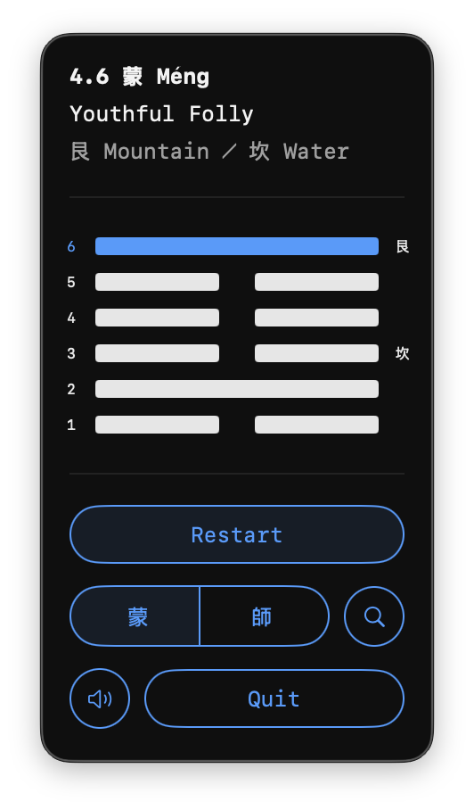

<p align="center">
  
</p>

<h1 align="center">Liu (六)</h1>

<p align="center">
  A minimalist I Ching oracle living in your macOS menu bar.
</p>

<p align="center">
  
  
  
</p>

<p align="center">
  
</p>

## About

Liu (六, "six" in Chinese) is a lightweight macOS menu bar app that lets you consult the I Ching using the traditional three-coin method. Cast hexagrams with a click, view changing lines, and look up interpretations — all without leaving your menu bar.

## Features

- **Three-coin method** — authentic I Ching divination using the classical coin toss algorithm
- **All 64 hexagrams** — complete hexagram library with Chinese names, pinyin, and English translations
- **Changing lines** — automatic detection and display of changing lines with relating hexagrams
- **Trigram display** — shows upper and lower trigrams for each hexagram
- **Sound effects** — ambient coin toss and guzheng sounds (can be muted)
- **Menu bar icon** — dynamic icon shows the current hexagram's unicode symbol
- **Lookup** — quick Google search for hexagram interpretations
- **Keyboard shortcuts** — toss (Return), lookup (F), mute (M), quit (Q), switch hexagrams (arrow keys)

## Requirements

- macOS 14.6 (Sonoma) or later
- Xcode 16+ (to build from source)

## Installation

1. Clone the repository:
   ```bash
   git clone https://github.com/jareksedy/Liu.git
   ```
2. Open `liu.xcodeproj` in Xcode
3. Build and run (Cmd+R)

The app runs as a menu bar item — look for the circled 六 icon in your menu bar.

## How It Works

The app uses the **three-coin method** of I Ching divination:

1. Click **Toss Coins** six times to build a hexagram from bottom to top
2. Each toss simulates three coins (heads = 3, tails = 2), producing values 6-9:
   - **6** (Old Yin) — broken line, changing
   - **7** (Young Yang) — solid line
   - **8** (Young Yin) — broken line
   - **9** (Old Yang) — solid line, changing
3. Changing lines (6 or 9) generate a **relating hexagram** showing the transformation
4. Switch between the primary and relating hexagram using the segmented control

## Project Structure

```
Liu/
├── App/            — App entry point
├── Models/         — Hexagram, Line, Trigram, SharedState
├── Views/          — Main view and helper views
├── Components/     — Reusable UI components
├── Services/       — Sound effects
├── Extensions/     — Int coin toss extension
├── Constants/      — UI constants
└── Sounds/         — Audio files
```

## Built With

- SwiftUI
- AppKit (menu bar image rendering)
- AVFoundation (sound effects)
- Firebase Analytics

## License

This project is licensed under the MIT License — see the [LICENSE](LICENSE) file for details.
